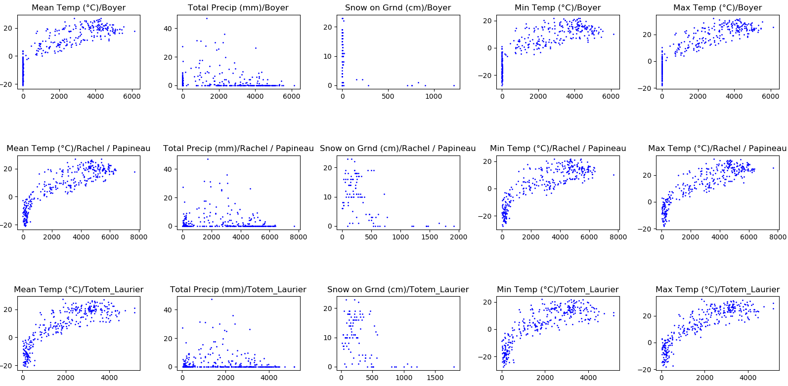
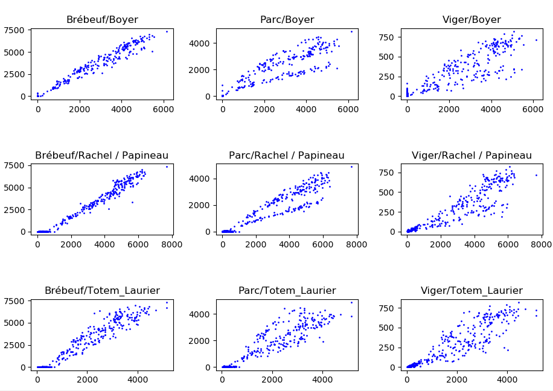

### Montreal Bicycle Count Regression

Uses the Montreal bike lane count dataset [1] and a Montreal weather dataset [2].

Written out of personal interest

###### Weather / Bike count correlations

###### Bike Lane / Bike Lane correlations

#### How to run

Just run poisson_weather, rfr_weather or adaboost_weather.

#### Dependencies
* pandas
* sklearn

[1]https://www.kaggle.com/pablomonleon/montreal-bike-lanes
[2]https://www.kaggle.com/rosemondeld/weather-montreal-2015-en